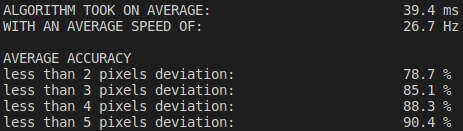
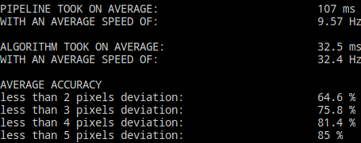

# CHANGELOG

## 2020/02/01: 

Better adapting to OpenCV 3.X and different CPUs: 

- Modified the interface of exFAST to fit OpenCV 3.X

- Fixed debug when using OpenCV 3.3.1+ by add definition `OPENCV_TRAITS_ENABLE_DEPRECATED`

- Replaced single precise floating to double precise in Triangle for dead loop problem, more info please refer to [Triangle trubleshooting](https://www.cs.cmu.edu/~quake/triangle.trouble.html)

Finetuned the parameters to keep balance between frequence and accuracy, the frequency has dropped to 26Hz (on my laptop) and the accuracy (disp<3pix) has rasized to 85.1%:

- Replaced high gradient pixels computing function with OpenCV Sobel

- Deleted final unnecessary triangulation

- For OpenCV 3.X, also using exFAST feature detector

- `im_grad`: 30 -> 60 

- `adaptive`: 1.0 -> 0.3

- `min_threshold`: 10 -> 15

- `uniqueness`: 0.4 -> 0.6 (Important)

We find that `uniqueness` has a great effect to both accuracy and frequency. Using Sobel to extract high gradient pixels is also better because the original function tends to be clustered.

Currently this repo's results are as follow (ON MY LAPTOP): 

## 2020/01/15: 

Reorgnized project structure.

Acclcerated the efficience of the algorithm from 16Hz to OVER 30Hz:

- Extracting high gradient pixels and preserving the coordinates simultaneously.

- Using Scanline Algorithm to allocate triangulates' indexs to all pixels.

We haven't make improvements to the accuracy of this repo, so there still remain a great gap between the results provided by the paper and by the implementation.

Currently this repo's results are as follow: 

